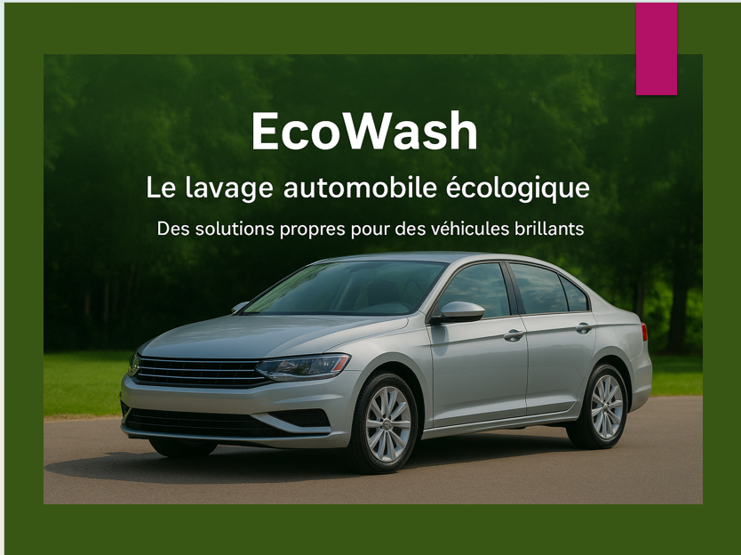

# EcoWash - Site Web de Lavage Automobile Écologique



## Description

EcoWash est une application web complète pour un service de lavage automobile écologique. Le site permet aux utilisateurs de s'inscrire, se connecter et réserver des services de lavage. Un tableau de bord administrateur permet de gérer les réservations et les messages de contact.

## Technologies utilisées

- **Frontend**: React.js + Vite + TailwindCSS
- **Backend**: Node.js + Express.js
- **Base de données**: MongoDB
- **Authentification**: JWT (JSON Web Tokens)
- **Email**: Nodemailer (Gmail SMTP)

## Fonctionnalités

### Utilisateurs
- Inscription et connexion
- Réservation de services de lavage
- Suivi des réservations
- Formulaire de contact

### Administrateur
- Tableau de bord avec statistiques
- Gestion des réservations (approuver, refuser, marquer comme terminée)
- Gestion des messages de contact
- Envoi automatique d'email lors de l'approbation d'une réservation

## Installation

### Prérequis
- Node.js (v18 ou supérieur)
- MongoDB (local ou Atlas)
- Un compte Gmail avec mot de passe d'application

### 1. Cloner le projet
```bash
cd "c:\Users\amado\OneDrive\Bureau\SESSION 1\siteWebEcoWash"
```

### 2. Installer les dépendances du serveur
```bash
cd server
npm install
```

### 3. Installer les dépendances du client
```bash
cd ../client
npm install
```

### 4. Configuration

Le fichier `.env` dans le dossier `server` est déjà configuré avec vos informations.

### 5. Créer l'administrateur
```bash
cd ../server
npm run seed
```

### 6. Démarrer MongoDB
Assurez-vous que MongoDB est en cours d'exécution sur votre machine.

### 7. Démarrer le serveur
```bash
cd server
npm run dev
```

### 8. Démarrer le client (dans un nouveau terminal)
```bash
cd client
npm run dev
```

## Accès

- **Site web**: http://localhost:3000
- **API**: http://localhost:5000

### Identifiants Admin
- **Email**: amadouourymargar@gmail.com
- **Mot de passe**: diallo123!

## Structure du projet

```
siteWebEcoWash/
├── client/                 # Frontend React
│   ├── public/
│   ├── src/
│   │   ├── components/     # Composants réutilisables
│   │   ├── context/        # Context API (Auth)
│   │   ├── pages/          # Pages du site
│   │   └── services/       # Appels API
│   └── package.json
│
├── server/                 # Backend Express
│   ├── config/             # Configuration DB
│   ├── middleware/         # Middleware Auth
│   ├── models/             # Modèles Mongoose
│   ├── routes/             # Routes API
│   ├── utils/              # Utilitaires (email)
│   ├── .env                # Variables d'environnement
│   └── package.json
│
├── Images/                 # Images du site
│   ├── photoAcceuil.png
│   ├── photoDuGarage.png
│   └── photoDuProduit.png
│
└── README.md
```

## Services proposés

| Service | Prix |
|---------|------|
| Lavage Extérieur | 20-30 $ |
| Lavage Complet | 40-60 $ |
| Forfait Mensuel | 200 $ |

## Contact

- **Adresse**: 3030 Rue Hochelaga, Montreal, Qc H1W 1G2
- **Téléphone**: 438-674-3689
- **Email**: amadouourymargar@gmail.com

## Licence

© 2024 EcoWash. Tous droits réservés.
